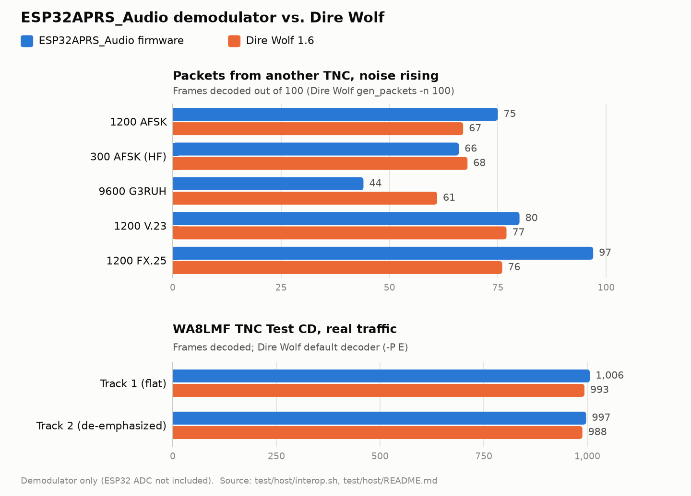

# Host tests (no hardware)

These tests compile the firmware's **real** code for a PC and run it with AddressSanitizer and
UndefinedBehaviorSanitizer, which stop at the first buffer overflow, use-after-free or undefined
behaviour and point at the firmware file and line.

## What is tested

| File | Firmware code | What it checks |
|---|---|---|
| `test_modem.cpp` | `AX25.cpp`, `modem.cpp`, `fx25.cpp` | Full loopback: TNC2 text → AX.25 frame → **real modulator** → audio → **real demodulator** → frame. 1200, 300, 9600 baud and V.23, FX.25, 3 frames in one TX, 250-character info, 8-hop path, end of TX and time-out, TX abort, TX across the `millis()` wrap, oversized packets. |
| `test_noise.cpp` | modem | Decode rate vs. white noise (reference curve below) and the 44.1 kHz WAV path. |
| `test_config.cpp` | `config.cpp` | Atomic save: power cut at any point of the write and between the renames, corrupt file, `.bak`, JSON without keys. Uses an in-memory filesystem (`shim/FS.h`). |
| `test_digi.cpp` | `digirepeater.cpp` | WIDE1-1, WIDE2-2, TRACEn-N, used path, no path, Internet packets (`qA`/`TCPIP`), NOCALL, full path. |
| `interop.sh` | modem | Interoperability with Dire Wolf in every mode, both directions (see below). Separate script: `interop.ps1`. |

`shim/` holds minimal replacements for Arduino/ESP-IDF (simulated clock, logging, in-memory
LittleFS). `host_stubs.cpp` replaces the parts of `AFSK.cpp` that touch hardware (DAC, ADC, PTT,
LEDs).

## Running them

Requires Docker Desktop running (uses the `gcc:13` image; nothing is installed on Windows):

```powershell
powershell -File test\host\run.ps1            # all tests
powershell -File test\host\run.ps1 config     # only tests whose name contains "config"
```

On Linux or macOS with gcc: `make -C test/host` (optionally `T=filter`).

The output ends with `N tests, N checks, 0 failures`. If a sanitizer finds something, the run
stops showing the firmware file and line.

## Reference results

<picture>
  <source media="(prefers-color-scheme: dark)" srcset="../../docs/images/test-results-dark.png">
  
</picture>

The chart is generated by [docs/images/make_test_charts.py](../../docs/images/make_test_charts.py)
from the numbers below.

### Interoperability with Dire Wolf (all modes, both directions)

`interop.sh` uses [Dire Wolf](https://github.com/wb2osz/direwolf) 1.6, an independent and widely
used software TNC, as "the other station":

- **RX:** Dire Wolf's `gen_packets -n 100` writes 100 frames with noise increasing frame by
  frame. They are decoded by this firmware and, on the same file, by Dire Wolf's own `atest`.
- **TX:** this firmware's modulator writes 100 frames (`wav_decode --tx`) and `atest` decodes them.
- **V.23** (1300/2100 Hz): `atest` only knows the standard tones, so both V.23 checks run the full
  `direwolf` program configured with `MODEM 1200 1300:2100`, reading the audio from stdin.

```powershell
powershell -File test\host\interop.ps1
```

| Mode | RX: firmware (Dire Wolf) out of 100 noisy frames | TX: decoded by Dire Wolf |
|---|---|---|
| 1200 AFSK (Bell 202, VHF APRS) | **75** (67) | 100/100 |
| 300 AFSK (1600/1800 Hz, HF APRS) | **66** (68) | 100/100 |
| 9600 G3RUH | **44** (61) | 100/100 |
| 1200 FX.25 | **97** (76) | 100/100 |
| 1200 V.23 (1300/2100 Hz) | **80** (77) | 100/100 |

- Every mode interoperates with Dire Wolf in both directions. Before PR13, 9600 baud failed both
  ways (see the bug list below).
- 1200 AFSK, 300 AFSK, V.23 and FX.25 decode as well as or better than Dire Wolf under noise. FX.25 is
  far ahead because its forward error correction repairs frames the plain decoder loses.
- 9600 baud works but is weaker than Dire Wolf with noise (44 vs 61): a known area to improve.
  It matters little for APRS, which is 1200 baud on VHF.

### Decode rate vs. noise (1200 baud)

From `noise_decode_rate_1200`: 40 packets per row, synthetic AFSK from the firmware's own
modulator plus white Gaussian noise. Signal ≈ ±510 peak / 360 RMS in ADC units.

| Noise std | SNR | Normal audio (de-emphasized input setting) | Flat audio setting |
|---|---|---|---|
| 0 | — | 40/40 | 40/40 |
| 100 | 11.1 dB | 40/40 | 40/40 |
| 200 | 5.1 dB | 27/40 | 40/40 |
| 300 | 1.6 dB | 0/40 | 0/40 |
| 400 | −0.9 dB | 0/40 | 0/40 |

The synthetic signal is flat (no de-emphasis), so the "flat audio" column is the meaningful one.
The test fails if the 11 dB row drops below 39/40. If a change to the demodulator moves these
numbers, update this table in the same commit and explain why.

### WA8LMF TNC Test CD (demodulator only)

Measured with `wav_decode` on the TNC Test CD **version 2.0** (FLAC tracks converted to WAV,
44.1 kHz) on 2026-10-09. "Deemphasis Audio ON/OFF" is the web setting (`config.audio_lpf`)
that selects the demodulator's input filter.

| Track (v2.0 file) | Content | Deemphasis Audio ON | Deemphasis Audio OFF (default) | Dire Wolf reference |
|---|---|---|---|---|
| `01_40-Mins-Traffic` | Real traffic, flat audio (= "Track 1" in Dire Wolf's paper) | **1006** | 989 | 993 – 1021 |
| `02_...DE-emphasized` | Same traffic, de-emphasized (= "Track 2"; the v2.0 file name is wrong) | 950 | **997** | 988 – 1022 |
| `03_100-Mic-E-Bursts-Flat` | 100 identical Mic-E packets | **100/100** | **100/100** | 100 |
| `04_25-MIns-Drive-Test` | Mobile with fading/multipath | **99** | 93 | — |

Dire Wolf reference: "A Better APRS Packet Demodulator, Part 1, 1200 baud" (WB2OSZ), range of its
decoder variants. In the same paper, on-air over 9 hours, a Kantronics KPC-3+ heard 70 % of what
Dire Wolf heard.

How to read it:
- The firmware's demodulator, fed with clean audio, is **in the same range as Dire Wolf** on both
  tracks, when the setting matches the audio: **ON for flat audio** (discriminator / data jack),
  **OFF for speaker audio** (already de-emphasized). The wrong setting costs 2–5 %.
- Consecutive identical frames (18 per track) are 0.3–1.1 s apart: separate transmissions on the
  channel, not double decodes.
- This measures the demodulator alone. The ESP32 ADC (noise, non-linearity, level) and the radio
  are not included; the hardware test in [docs/test-plan.md](../../docs/test-plan.md) section 1
  shows how much of this survives on the real unit.

### Bugs found by these tests (fixed in PR13)

Found by the loopback tests:

| Bug | Effect |
|---|---|
| `N9600` was 1, so `PLL9600_STEP` = 2³² overflowed the `int32_t` PLL step to 0 | 9600 baud reception never worked |
| G3RUH scrambler advanced on every DAC sample (4 per bit) and shared its LFSR with the descrambler | 9600 baud transmissions could not be decoded by any receiver |
| With 8 digipeaters, no end-of-address bit was set (`ax25_encode`, `hdlcFrame`) | Frames with full paths could not be decoded |
| FX.25 RX did not check `lastCrc` like the AX.25 path | Every FX.25 packet was delivered twice (once per demodulator) |
| `abs(INT32_MIN)` on the wrapping DCD PLL counter (UBSan) | Undefined behaviour; worked on the ESP32 by accident |

Found by `cppcheck`:

| Bug | Effect |
|---|---|
| `parse_aprs.cpp`: `snow[3] = 0` on a 3-byte array | 1-byte stack overflow on a WX packet with a snow field (from RF or APRS-IS) |
| `weather.cpp`: wind gust loop with an uninitialized index | Undefined behaviour, reads outside `wgArray` |
| `handleATCommand.cpp`: `strncpy` without terminator for `AT+TIME` | Reads past the buffer with a long command |
| `AX25.cpp`: `txInitStage == TX_INIT_OFF;` in `Ax25Init` | Comparison instead of assignment: no effect |
| `main.cpp`: `tlm_sz` passed uninitialized | Harmless (the parameter is ignored), initialized |

Run `cppcheck` the same way:

```powershell
docker run --rm -v "${PWD}:/src" -w /src gcc:13 sh -c "apt-get -qq update && apt-get -qq install -y cppcheck >/dev/null && cppcheck --enable=warning,portability --inconclusive --std=c++17 --max-configs=1 -D__XTENSA__ -DCONFIG_IDF_TARGET_ESP32S3 -DTTGO_TWR -DGUI_LCD -DENABLE_FX25 --suppress=missingInclude --suppress=missingIncludeSystem -q src lib/LibAPRS_ESP32"
```

Remaining findings are known and harmless: `printf` signed/unsigned mismatches of the same size,
uninitialized class members, dead code, and the `#error` of an unused VPN configuration branch.

## Decoding recordings (WA8LMF TNC Test CD)

The `wav_decode` tool runs a 16-bit WAV through the firmware's demodulator and counts frames:

```powershell
docker run --rm -v "${PWD}:/src" -w /src/test/host gcc:13 make wav WAV=/src/track1.wav ARGS="1200"
# ARGS: 1200 | 300 | 9600 | v23, "flat" for "Deemphasis Audio" ON, "-v" to list the frames with their time
```

It can also generate audio with the firmware's modulator (used by `interop.sh`):

```text
wav_decode --tx <out.wav> [1200|300|9600|v23] [fx25] [count]
```

The WAV must be inside the project folder (it is mounted as `/src`).

**Limit:** the WAV goes straight into the demodulator. The ESP32 front-end (real ADC, DC removal,
AGC, decimation) is not included, so the result measures the demodulator; the real unit may do
somewhat differently because of ADC noise and non-linearity. See
[docs/test-plan.md](../../docs/test-plan.md).

## What these tests do not cover

The ESP32 ADC and DAC, the radio and PTT timing, WiFi with real routers, the web server, the
FreeRTOS tasks running concurrently, power and temperature. Interoperability is checked against
one independent implementation (Dire Wolf), on clean generated audio. All of that is in
[docs/test-plan.md](../../docs/test-plan.md).

## Adding a test

Create `test_something.cpp` in this folder (the Makefile picks up every `test_*.cpp`):

```cpp
#include "test.h"
TEST(my_test)
{
    CHECK(1 + 1 == 2);
    CHECK_EQ_INT(value, 3);
    CHECK_EQ_STR(text, "expected");
}
```

If new firmware code needs something from Arduino/ESP-IDF that is missing, add it to `shim/`.
